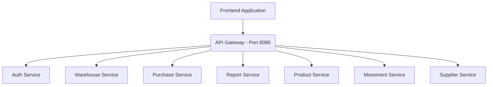

# StockPro Frontend Architecture

The StockPro Frontend is built using React and Vite, communicating with a Spring Boot Microservices backend via an API Gateway.

## Component Architecture

## Technologies
- React (Components, Hooks)
- Vite (Build Tool)
- React Router (Routing)
- Axios (API Calls)
- Bootstrap (Styling)
- Vitest (Testing)
- React Focus Lock (Accessibility)

## Structure
- `src/components/`: Reusable UI components
- `src/pages/`: Route-level page components
- `src/services/`: API integration services
- `src/layouts/`: Common layouts (Sidebar, Header)
- `src/__tests__/`: Unit and integration tests
